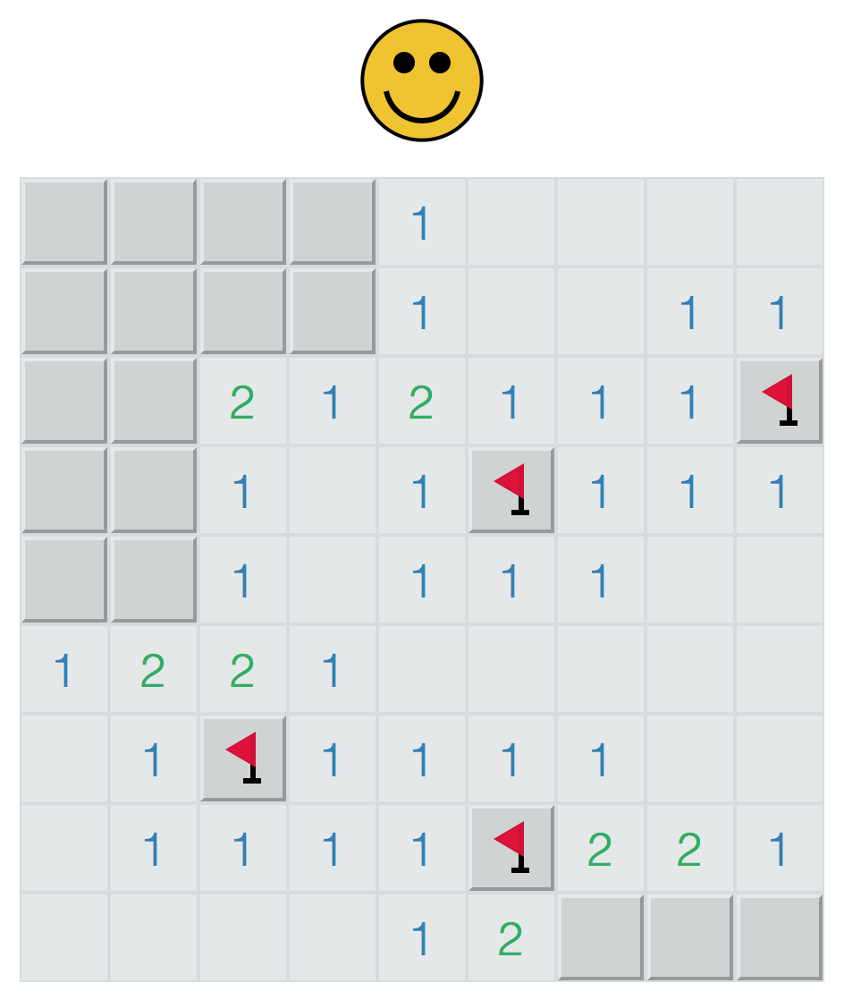

# Minesweeper

A basic implementation of Minesweeper in ClojureScript




## Starting Fighweel

Run Cider Jack-In Clojurescript "C-c M-J"

In the CLJS repl:
```clojure
;; exit the cljs repl
cljs/quit

;; start figwheel (defined in dev/user.clj) - starts both dev and devcards profiles
(start-figwheel!)

;; go back into the cljs repl (defined in dev/user.clj) (needed for Cider)
(cljs-repl)
```

Alternatively we can customise the Clojurescript jack in command to start figwheel, e.g.
.emacs.d config - custom cljs lein repl

```clojure
(require 'cider)
(setq cider-cljs-lein-repl
      "(do (require 'figwheel-sidecar.repl-api)
           (figwheel-sidecar.repl-api/start-figwheel!)
           (figwheel-sidecar.repl-api/cljs-repl))")
```

## Start Devcards

Devcards UI: http://localhost:3449/tests.html

```clojure

;; quit the browser connected REPL
:cljs/quit

;; start the devcards build
(figwheel-sidecar.repl-api/switch-to-build "devcards-test")

;; or alternatively run both devcards and dev
(figwheel-sidecar.repl-api/switch-to-build "devcards-test" "dev")

;; back into the browser connected REPL
(figwheel-sidecar.repl-api/cljs-repl "dev")
```

## Start Figwheel from REPL

This is not needed as we've customised the Cider command
to start the browser connected REPL during clojurescript
jack in.

```clojure
(use 'figwheel-sidecar.repl-api)
(start-figwheel!)
(stop-figwheel!)
```

## Running from the command line

### CLJS app and devcards (to see unit tests in browser)
```
lein figwheel devcards-test dev
```

### Unit tests with phantomjs
Configured in project.clj [:cljsbuild :test-commands]
```
lein cljsbuild test
```

## Build minified js

```
lein cljsbuild once min
```
